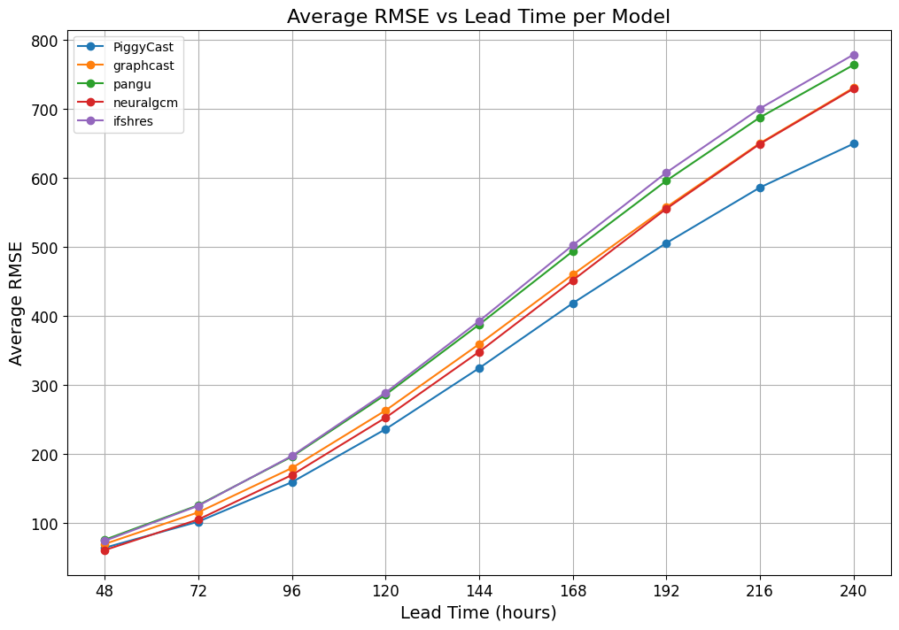

# PiggyCast: Improving Weather Prediction Accuracy through a Stacking-Based Ensemble AI Approach

📍 **Master's Thesis – African Institute for Mathematical Sciences (AIMS) - South Africa (Accredited by Stellenbosch University)**  
🎓 MSc in Mathematical Sciences (AI for Sciences)

---
<div align="center">
  
  <p><em>Figure: PiggyCast Model Futuristic Lab. Generated with Gemini</em></p>
</div>


---


## 🔍 Abstract

Recently, AI Weather Prediction (AIWP) models have outperformed classical Numerical Models in various weather prediction benchmarking criteria. Given the paradigm shift from numerical to machine learning models, such forecasts can be generated in seconds to minutes on a standard laptop. Forecast datasets from frontier AIWP models for the year 2020 are publicly available  via [WeatherBench 2](https://github.com/pangeo-data/WeatherBench2), facilitating independent analysis, evaluation, and further research.

In this study, we introduce a traditional machine learning model trained on top of these forecast datasets (a method known as “stacking”) to predict ERA5 variables, thereby exploiting the strengths of each base model and aiming to outperform forecasts from any base model alone. We coin our model **PiggyCast**, as we effectively piggyback off the work done by leading AI research teams with expertise and compute budgets for model training that are hard to match in an MSc thesis.

The improvement in PiggyCast’s **Root Mean Squared Error on Geopotential Height at 500 hPa pressure**, relative to the base models, was notable, with an increase in performance as forecast lead time increased. Given the low compute cost of making forecasts, and that each frontier AIWP model has its strengths and weaknesses (depending on the weather variable, region of the globe, and forecast lead time), we argue that the future of the most skilful weather forecasts will likely come from machine learning stacking, by the very nature that stacking typically yields performance better than any base model alone.

<div align="center">
  
  <p><em>Figure: Average RMSE vs Lead Time Per Model</em></p>
</div>

---

## 📁 Repository Structure

```
AIMS_Masters_Thesis/
├── Notebooks/
│ ├── DataPrep/ # Data preprocessing
| |   ├── WB2 _Keisler_model_forecasts.ipynb
| |   └── wb2_dataprep.ipynb
│ ├── PiggyCast/ # Model training and evaluation
| |   ├── wb2_ml_nestedXGBoost_48hrs_lead_time.ipynb
| |   ├── wb2_ml_nestedXGBoost_72hr_lead_time.ipynb
| |   ├── wb2_ml_nestedXGBoost_all_lead_times_without_keisler.ipynb
| |   └── wb2_ml_nestedXGBoost_Sensitivity_to_Training_Length.ipynb
│ ├── Unsupervised Learning/ # Exploratory and clustering analyses
| |   ├──Multidimensional_Scaling and Dendrogram.ipynb
| |   └──Pairwise RMSE Matrix & MDS 72 Hours Lead Time.ipynb
├── Plots/ # Visual results
├── Report/ # Thesis write-up
└── README.md # You're here
```
